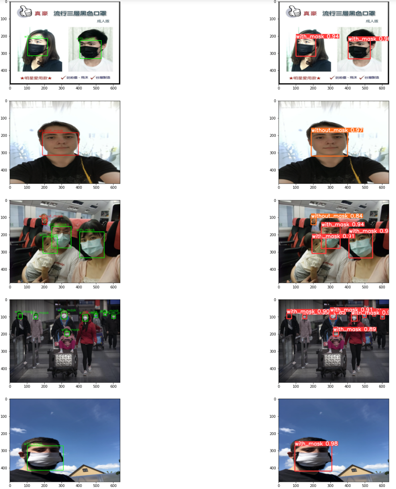

# FaceMaskDetection

## Trying the Model
An application has been created for the trained model. You try it [here](https://share.streamlit.io/luk413/facemaskdetection/main/main.py)!

## Running the Notebook
To run the notebook, begin by cloning the repository. Then, install the requirements using
```
pip install -r notebook_requirements.txt && cd yolov5 && pip install -r requirements.txt 
```
After that, the data can be installed from Kaggle. If you have an account and an API key, use the following command
```
kaggle datasets download -d andrewmvd/face-mask-detection 
```
Otherwise, the data can be accessed via the following [link](https://www.kaggle.com/andrewmvd/face-mask-detection).
The data should then be unzipped and then renamed to 'face-mask-detection'. Create a folder called 'datasets' and move 
the data to that folder.

Run the Jupyter Notebook to see the results.

## Results
### Training Metrics

### Validation Metrics


### Inference

## Acknowledgements
### Dataset
```
@misc{make ml,
title={Mask Dataset},
url={https://makeml.app/datasets/mask},
journal={Make ML}
}
```
### YoloV5 Model
The model I used to train and test this was from [Glenn Jocher's YoloV5](https://github.com/ultralytics/yolov5). 